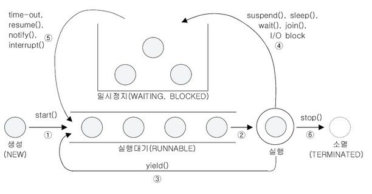

Ch12. 쓰레드
===
## 프로세스와 쓰레드

- 프로세스란 실행 중인 프로그램

- 프로세스는 프로그램을 수행하는 데 필요한 데이터와 메모리 등의 자원과 쓰레드로 구성

    프로세스 = 자원 + 쓰레드

- 모든 프로세스에는 하나이상의 쓰레드가 존재, 둘 이상의 쓰레드를 가진 프로세스를 멀티쓰레드 프로세스라고 함

## 쓰레드의 구현과 실행

- Thread 클래스를 확장하는 방법

```java
class MyThread extends Thread {
    MyThread() {
        super();
    }
    MyThread(String name) { // 쓰레드 이름 지정 가능
        super(name);
    }
    public void run() {
        // 쓰레드에서 실행할 내용
    }
}
...
MyThread t1 new MyThread();
MyThread t2 new MyThread("##쓰레드##"); // 이름을 지정한 쓰레드
t1.start();
t2.start();
```

- Runnable 인터페이스를 구현하는 방법

```java
class MyThread implements Runnable {
    public void run() {
        // 쓰레드에서 실행할 내용
    }
}
...
// Thread 인스턴스를 생성할때 target으로 Runnable을 구현한 클래스의 인스턴스를 넘긴다
Thread t1 = new Thread(new MyThread());
Thread t2 = new Thread(new MyThread(), "##쓰레드##"); // 이름을 지정한 쓰레드
t1.start();
t2.start();
```

## start()와 run()

- run()을 호출하는 것은 생성된 쓰레드를 실행시키는 것이 아니라 단순히 클래스에 속한 메서드 하나를 호출하는 것

- start()를 호출하는 것은 새 쓰레드가 작업에 필요한 호출스택을 생성한 다음 run()을 첫번째로 호출하는 것

#### main()에서 start() 호출
1. start()는 쓰레드가 작업을 수행하는데 사용될 새 호출스택을 생성

2. 생성된 호출 스택에 run()을 호출해서 쓰레드가 작업을 수행하도록 한다

    한 쓰레드에서 예외가 발생해서 종료되어도 다른 쓰레드의 실행에는 영향을 미치지 않음

3. 이제 호출스택이 2개이기 때문에 스케줄러가 정한 순서에 의해 번갈아 가면서 실행

## 싱글쓰레드와 멀티쓰레드

- 작업을 싱글 쓰레드로 수행한 시간 ≒ 작업을 멀티 쓰레드로 수행한 시간
    보통 멀티쓰레드가 문맥전환(context switching) 때문에 작업시간이 더 길다

- 쓰레드 작업은 OS의 프로세스 스케줄러의 영향을 받음 (즉 OS에 종속)

        스케줄러는 어떤 쓰레드가 얼마동안 실행될 것인지 결정

- CPU 작업을 사용하는 작업은 싱글쓰레드가 유리, 그 밖의 IO 작업에 멀티쓰레드가 유리


## 쓰레드 우선순위(priority)

- 쓰레드는 멤버변수 priority의 값에 따라 상대적으로 쓰레드의 우선순위가 결정되고 priority 차이만큼 특정 쓰레드가 더 많은 작업시간을 갖도록 할 수 있다.

    빠른 응답이 필요한 작업의 경우 priority가 높은게 사용자 경험에 좋다

- priority의 범위는 1~10이며 숫자가 높을 수록 우선순위가 높다

- priority는 생성한 쓰레드로부터 상속받는다
    main 메서드의 priority의 기본값은 5

## 쓰레드 그룹(thread group)

- 모든 쓰레드는 쓰레드 그룹에 포함됨

- 쓰레드를 모아놓은것, 쓰레드 그룹은 쓰레드와 또 다른 쓰레드 그룹을 포함 할 수 있다

- 같은 쓰레드 그룹에 있는 쓰레드나 쓰레드 그룹은 변경 가능하지만 같은 쓰레드 그룹에 속해 있지않으면 변경이 불가능하다

#### 쓰레드 그룹의 생성과 포함

- TreadGroup클래스로 쓰레드 그룹 생성

- Thread의 생성자로 쓰레드 그룹에 포함

    따로 쓰레드 그룹을 지정하지 않으면 자신 쓰래드를 생성하는 쓰래드의 그룹에 포함된다

```java
// 쓰레드 그룹 생성
ThreadGroup pTGrp = new ThreadGroup("ParentThreadGroup");
// pTGrp 하위에 쓰레드 그룹 생성
ThreadGroup cTGrp = new ThreadGroup(pTGrp, "ChildThreadGroup");
// 쓰레드를 cTGrp 쓰레드 그룹에 포함
Thread t1 = Thread(cTGrp, "Thread");
```

- JVM은 main과 system이라는 쓰레드 그룹을 만든다

    main 메서드를 수행하는 main 쓰레드는 main 쓰레드 그룹에 포함

    가비지 컬렉팅하는 Filnalizer 쓰레드는 system 쓰레드 그룹에 포함

## 대몬 쓰레드

- 일반 쓰레드의 작업을 돕는 보조 역할을 수행하는 쓰레드

    ex) 가비지 컬렉터

- 대몬 쓰레드의 생명주기는 start()에 실행되며 일반 쓰레드가 모두 종료될 때 대몬 쓰레드도 종료된다

- 쓰레드를 생성후 start()호출 전 setDeamon(true)를 호출하면 대몬 쓰레드가 된다

## 쓰레드의 실행제어

- 쓰레드 실행을 제어하기 위해 동기화(syncronization)와 스케줄링이 필요

- 쓰레드 실행 제어를 위한 쓰레드 상태 제어 메서드

    - void interrupt() : sleep 메서드나 join 메서드에 의해 일시정지 상태인 쓰레드를 InterruptException 발생시켜 실행대기 상태로 만듬

    - void join() : 지정된 시간동안 쓰레드를 실행

    - void resume() : suspend 메서드에 의해 일시정지상태의 쓰레드를 실행대기상태로 만듬

    - static void sleep() : 지정된 시간동안 쓰레드를 일시정지시키고 지정된 시간 이후 실행대기상태가 됨

    - void stop() : 쓰레드를 즉시 종료

    - void suspend() : 쓰레드를 일시정지 시킴, 다시 실행대기를 하기위해 resume 메서드를 호출해야 함

    - static void yeild() : 실행 중 다른 쓰레드에게 양보하고 실행대기상태가 됨

    - resume(), stop(), suspend()는 교착상태에 빠지기 쉽기 때문에 deprecated됨!

- getState()로 쓰레드 상태 확인

    - NEW : 쓰레드가 생성되고 아직 start 메서드가 호출되지 않은 상태

    - RUNNABLE : 실행 중 또는 실행 가능한 상태

    - BLOCKED : 동기화 블럭에 의해 일시정지된 상태(lock이 풀릴 때 까지 기다리는 상태)

    - WAITING / TIMED_WAITING : 일시정지 상태 즉 쓰레드의 작업이 종료되지 않았지만  실행가능하지 않은 상태

        TIMED_WAITING은 일시정지시간이 지정된 경우

    - TERMINATED : 쓰레드의 작업이 종료된 상태



## 쓰레드의 동기화

- 자원을 여러 작업이 공유했을때 작업의 결과 의도한 결과와 달라질 수 있다

- 동기화는 자원에 lock을 걸어 제어권을 독점한다

#### 동기화 사용

- 특정 객체에 lock을 걸기

```java
syncronized(객체의 참조변수) { // 객체의 lock 시작
    // ...
} // 객체의 lock 종료
```

- 메서드에 lock을 걸기

```java
public syncronized void 메서드명() { // 메서드의 lock 시작
    // ...
} // 메서드의 lock 종료
```
#### 동기화 사용시 교착상태

- 쓰레드 간 lock을 건 상태에서 서로 lock이 풀리기를 기다리는 상황

- 쓰레드가 자원에 lock을 건 상태에서 쓰레드가 종료되거나 정지되면 그 자원을 사용하려는 쓰레들은 영원히 기다려야할 수 도 있음

    deprecated된 상태 제어 api인 stop, suspend, resume 메서드들이 그런 교착상태를 야기시킬 수 있기때문에

    내부에서 while과 if문으로 쓰레드를 제어를 작성하거나 suspend 메서드대신 wait 메서드를 사용하고 resume 메서드대신 notify 메서드를 사용하여 교착상태를 피해야 한다


#### wait()과 notify()

- wait, notify 메서드는 Object 클래스에 정의된 메서드

- 동기화 블럭에서만 사용가능

- wait 메서드를 호출하면 자식이 자원에 걸어 놓앗던 모든 lock을 풀고 wait이 호출된 객체의 waiting pool에서 기다림

- notify 메서드를 호출하면 waiting pool에서 벗어나 다시 실행대기 상태가 된다

- notify 메서드는 waiting pool 중 하나의 쓰레드만 깨우고 notifyAll 메서드는 waiting pool의 모든 메서드를 깨운다

    notify 메서드를 호출할때 어떤 쓰레드가 깨워지게될지 알 수 없다 때문에 notifyAll을 호출하여 모두 깨운후 스케줄러에 의해 처리되게하는 것이 안전


---
